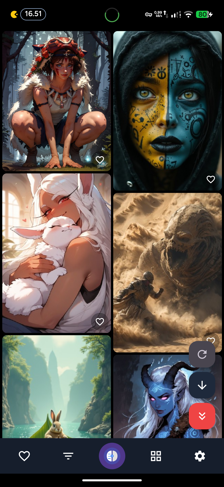
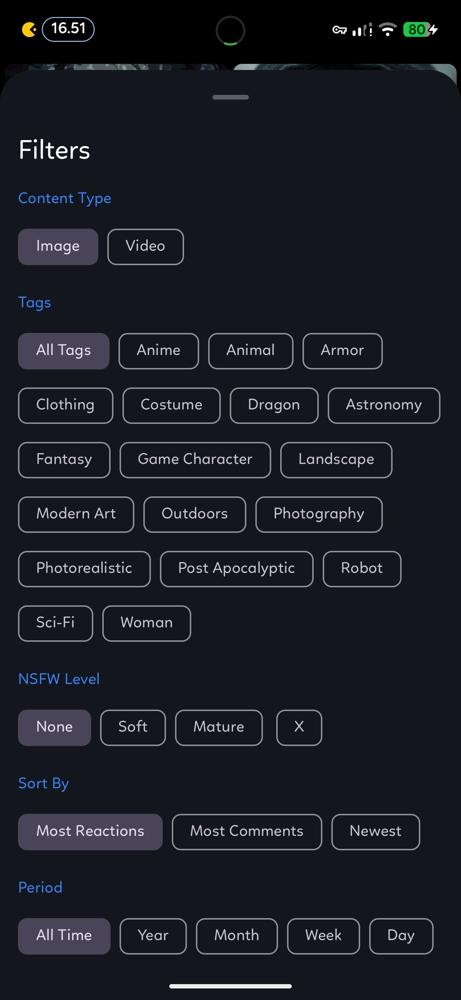
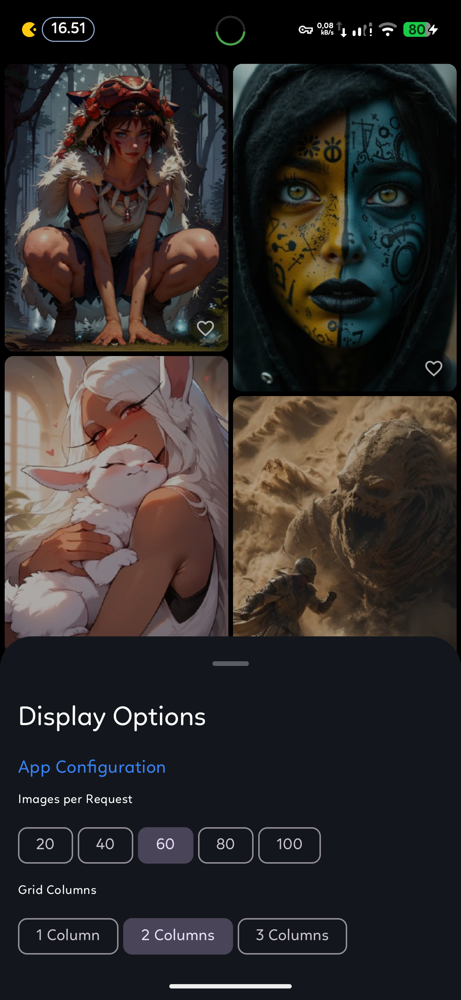
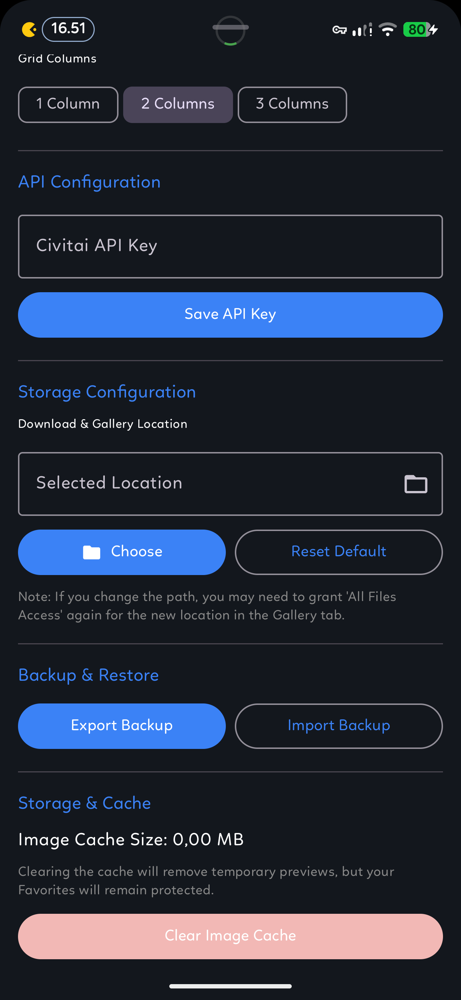

# DumbAI - Native Android Civitai Client

DumbAI is a premium, high-performance Android application designed for power users of the [Civitai](https://civitai.com) platform. Built from the ground up with **Kotlin** and **Jetpack Compose**, it offers a buttery-smooth, native experience for discovering, filtering, and organizing high-quality AI generations.

## Key Features

### Cutting-Edge Performance

- **Native Engine**: Fully written in Kotlin using modern Jetpack Compose for the highest possible frame rates and efficient memory usage.
- **Intelligent Batching**: Fetches images in optimized batches to ensure instant loading and zero scrolling lag.
- **High-Speed CDN Thumbnails**: Uses on-the-fly image resizing to load grid thumbnails instantly while preserving full quality for previews.

### Pro-Grade Media Gallery

- **Unified Media Support**: Seamlessly browse and view both high-resolution images and videos.
- **Integrated Video Player**: Powered by **Media3 ExoPlayer** for smooth, high-quality video playback with intuitive controls.
- **Fluid Navigation**: Swipe left and right to navigate through media batches with native `HorizontalPager` transitions.
- **Pinch-to-Zoom & Pan**: Inspect every detail with smooth multi-touch zoom and drag-to-pan capabilities for images.

### Advanced Filtering & Organization

- **Granular Filters**: Built-in support for Civitai's NSFW levels (None, Soft, Mature, X) and media types (Image/Video).
- **Dynamic Sorting & Periods**: Sort by Newest, Most Reactions, etc., across various time periods (All Time, Year, Month, etc.).
- **Local Favorites**: Securely save your favorite media to a local SQLite database for offline access.
- **Custom Tags**: Filter by specific tags to find exactly what you're looking for.

### Robust Data Management

- **Intelligent Caching**: Advanced disk and memory caching system keeps your browsing session fast and responsive.
- **Powerful Download Manager**: Download high-res media directly to your device with customizable paths and real-time progress tracking.
- **Backup & Restore**: Easily export and import your app settings and favorites as JSON files for seamless transitions between devices.

### Secure & Self-Contained

- **No Server Required**: Operates completely independently, ensuring your browsing habits remain private.
- **Material You**: Full support for Android 13+ themed icons and dynamic color schemes.
- **API Key Support**: Optional Civitai API key integration for personalized access.

## Tech Stack

- **UI Framework**: Jetpack Compose (Material 3)
- **Networking**: Retrofit 2 + OkHttp 4 + Moshi
- **Media Playback**: Media3 ExoPlayer
- **Image Handling**: Coil (Custom Caching)
- **Database**: Room (SQLite)
- **Settings**: Jetpack DataStore (Preferences)
- **Architecture**: MVVM with Kotlin StateFlow/SharedFlow
- **Concurrency**: Kotlin Coroutines & Flow

## Screenshots

|                       Main View                       |                   Filter Options                    |
| :---------------------------------------------------: | :-------------------------------------------------: |
|                   |  |
|                  **Display Options**                  |                    **Settings**                     |
|  |              |

## Build & Installation

### Prerequisites

- **JDK 21**
- **Android SDK** (API 34)

### Quick Start

```bash
./build.sh   # Clean, build, sign, and install the Release APK
```

The signed binary will be generated at:
`app/build/outputs/apk/release/app-release-signed.apk`

---

## Author

[**MOVZX**](https://github.com/MOVZX)

---

_Note: This project is a third-party client and is not officially affiliated with Civitai._
