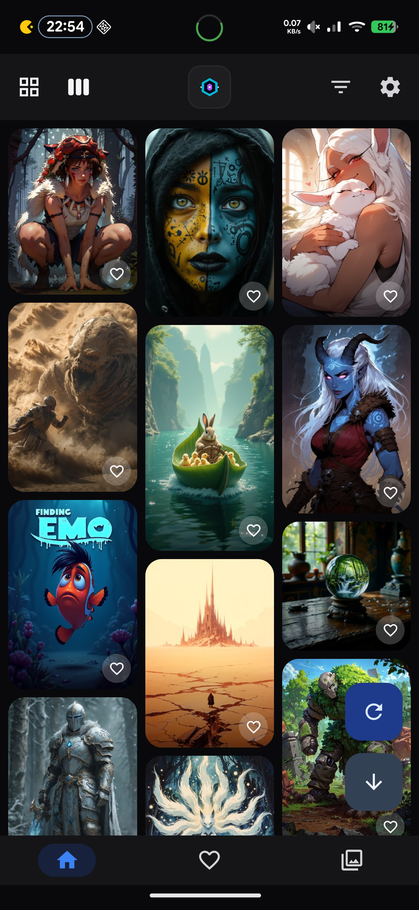
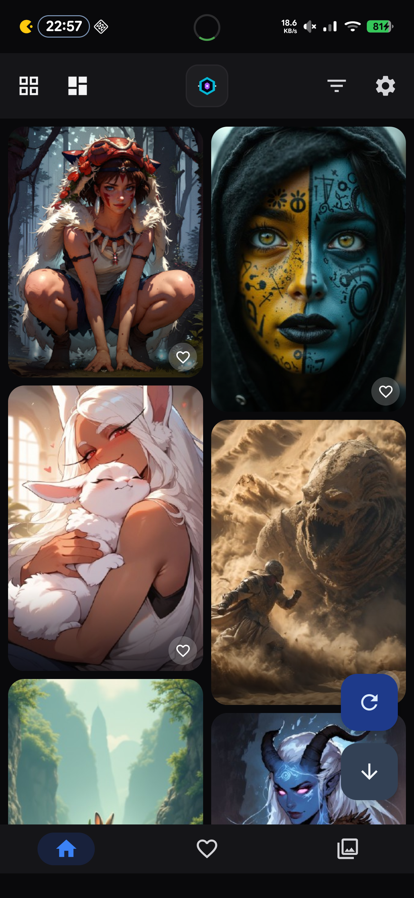
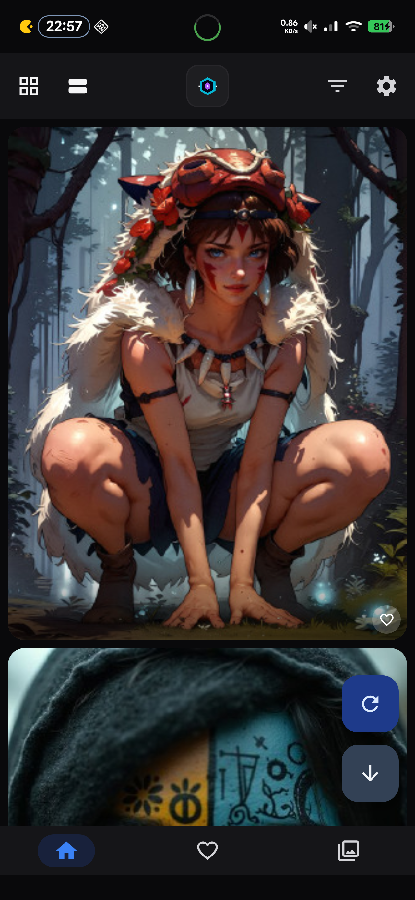
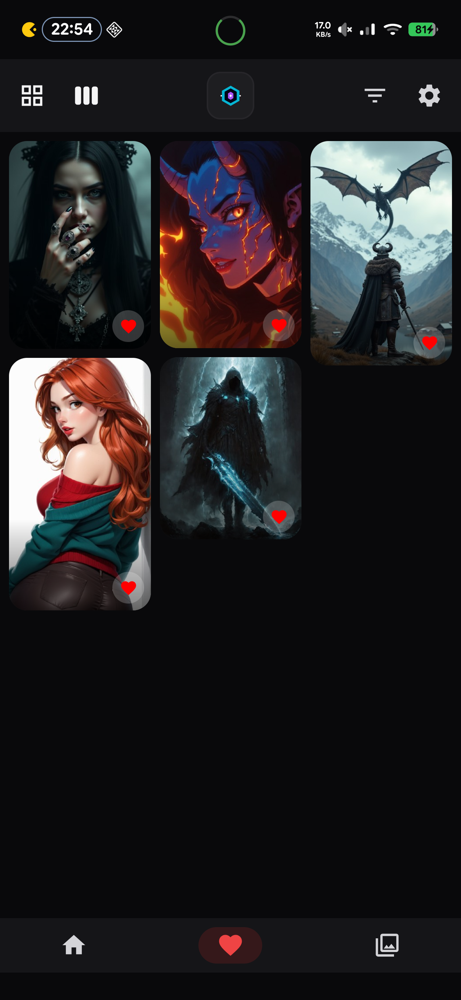
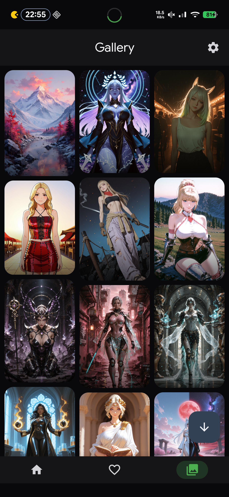
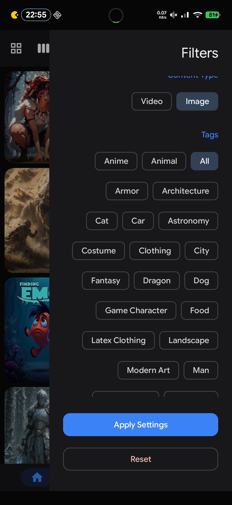
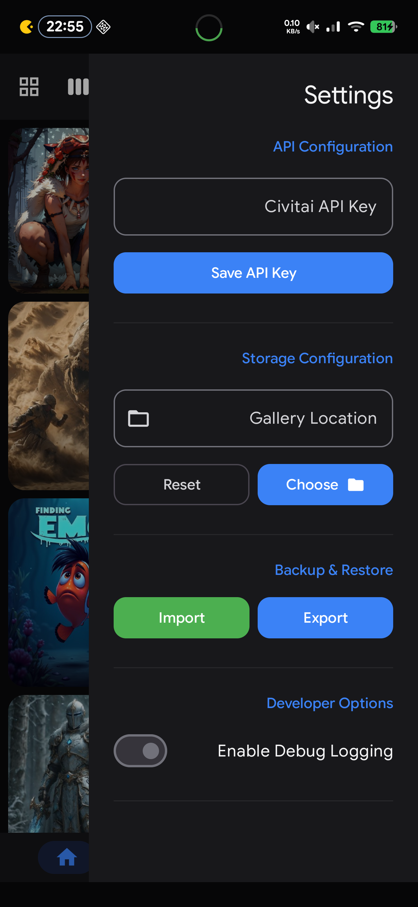
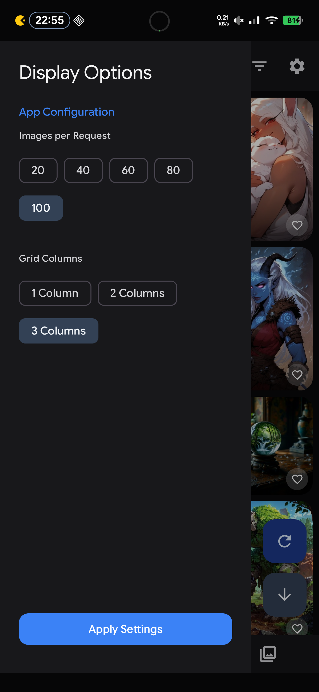

# DumbAI

**DumbAI** is a sophisticated **Android** client for the **Civitai** platform, built using modern software engineering principles and the latest **Android** development technologies. The application focuses on providing a high-performance, maintainable, and visually consistent experience for browsing and managing AI-generated media.

## Project Overview

The application follows the **Model-View-ViewModel** _(MVVM)_ architectural pattern, utilizing **Jetpack Compose** for a fully declarative user interface. A major architectural focus has been placed on logic centralization and UI consistency, resulting in a streamlined codebase that minimizes redundancy while maximizing scalability.

## Core Architecture

### ViewModel Layer

All business logic is driven by a centralized `BaseViewModel`, which standardizes:

- **Shared Actions**: Centralized logic for `toggleFavorite` and `performDownload` to ensure consistent behavior across all screens.
- **Persistent Preference Management**: Direct interface for grid layout, page limits, and content settings.
- **Scroll Management**: State-aware scroll position saving and restoration logic.
- **Message Bus**: A resource-ID based messaging flow for decoupled UI notifications _(Toasts)_.

### State Management

The application utilizes a **Unidirectional Data Flow** _(UDF)_ pattern. Each screen is driven by a `UiState` that implements a common `BaseUiState` interface, ensuring a consistent contract for images, loading states, and navigation metadata across the entire UI.

### Data Layer

The data layer is highly modular and utilizes specialized repositories:

- **GalleryRepository**: Manages local media scanning and public download operations.
- **FavoritesRepository**: Handles local caching of media resources _(thumbnails and previews)_ to ensure offline availability for favorited content.
- **UserPreferencesRepository**: Leverages **Jetpack DataStore** for persistent storage of application settings and navigation states.
- **BackupRepository**: Provides robust JSON-based import and export capabilities for user data.

## Key Features

### Dual-Sidebar Navigation

The application employs a unique navigation system based on nested **ModalNavigationDrawers**:

- **Left Sidebar**: Dedicated to display configurations, including grid column adjustments and request limits.
- **Right Sidebar**: A multi-mode panel that switches between advanced content filters and core application settings.
- **Direction Normalization**: Intelligent handling of layout directions to ensure the right-hand drawer content renders correctly in LTR mode within the RTL hack.
- **Consistent UI**: All sidebars utilize a unified `BaseSidebar` foundation with square edges and dynamic scrollbars for a professional aesthetic.

### Local Resource Caching

DumbAI prioritizes accessibility by automatically downloading and managing local copies of favorited images and video previews. This system ensures that the user's collection remains browseable regardless of network status.

### Smart Image Resolution

A dedicated utility layer dynamically resolves the most appropriate media source based on context. It intelligently switches between local cached files and remote URLs while optimizing thumbnail dimensions to conserve bandwidth without sacrificing visual quality.

### Dynamic Networking

The networking layer uses a custom **OkHttp Interceptor** to handle dynamic host switching _(supporting `civitai.red` for filtered content)_ and secure API key injection. Performance is optimized through atomic DataStore preference lookups, minimizing blocking calls during request interception.

## Screenshots










## Technical Stack

- **UI Framework**: Jetpack Compose _(Material 3)_
- **Dependency Injection**: Hilt
- **Networking**: Retrofit / OkHttp / Moshi
- **Database**: Room
- **Persistence**: Jetpack DataStore
- **Image Loading**: Coil _(including Video Frame support)_
- **Media Playback**: Media3 / ExoPlayer

## Project Structure

- `api/`: Retrofit interfaces and network interceptors.
- `data/`: Repositories, Room DAOs, and DataStore implementations.
- `model/`: Immutable data classes and API response models.
- `ui/`: Composable screens, shared components, and application themes.
- `util/`: Extension functions and logic utilities.
- `viewmodel/`: Specialized ViewModels inheriting from the centralized BaseViewModel.

## Build and Installation

The project uses a custom build system for streamlined deployment. To build and install the application on a connected device, execute the following command:

```bash
./build.sh install
```

This will compile the release APK, sign it, and perform a streamed installation.

## License

This project is licensed under the **MIT License** - see the [LICENSE](LICENSE) file for details.

---

<p align="center">
  Made with ❤️ by <a href="https://github.com/MOVZX">MOVZX</a>
</p>
